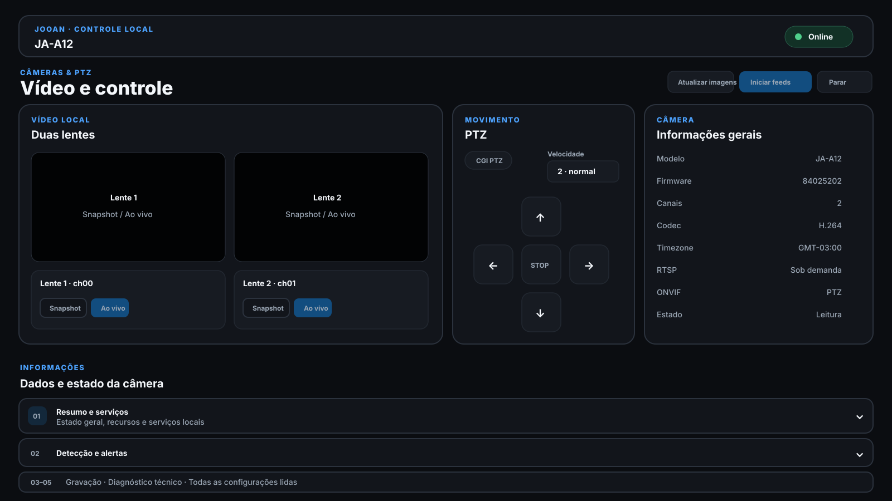

  

<h1 align="center">JOOAN Local Control</h1>

  Controle, diagnóstico e mídia de câmeras JOOAN/CAM720 diretamente pela rede local no Home Assistant.

  
  
  
  

  

<em>Visão vetorial do painel e das superfícies locais atualmente trabalhadas. É um diagrama de interface, não uma captura da câmera.</em>

## Instalação

Se o botão não preencher o repositório automaticamente:

1. Abra **Configurações → Apps → Loja de Apps**.
2. Abra **⋮ → Repositórios**.
3. Adicione:
   `https://github.com/lucaslucian/ha-jooan-ptz`
4. Instale **JOOAN Local Control**.
5. Informe IP, usuário e senha local da câmera.
6. Inicie o App e abra **JOOAN Local Control** pelo Home Assistant.

## O que o App faz hoje

| Recurso | Estado |
|---|---|
| Validação local da câmera | ✅ |
| PTZ cima/baixo/esquerda/direita/stop | ✅ |
| Informações do dispositivo | ✅ |
| Estado de rede | ✅ |
| Leitura de capacidades na porta 9898 | ✅ |
| Estado de SD, gravação, detecção, tracking e luzes | ✅ leitura |
| Detecção de lente dupla | ✅ |
| RTSP / credenciais locais | ✅ |
| Descoberta de streams/codec/áudio via ffprobe | ✅ probe sequencial mínimo v0.5.2 |
| Snapshots JPEG via RTSP | ✅ após stream confirmado |
| ONVIF 8899 `/onvif/device_service` | ✅ validado no JA-A12 stock |
| ONVIF GetProfiles/GetStreamUri/GetStatus/GetPresets | 🔬 read-only v0.4 |
| Laboratório ONVIF PTZ / IR | ✅ PTZ validado; IR aceito pelo firmware |
| ONVIF Events / PullPoint | ✅ movimento local confirmado; snapshots/transições separados v0.9 |
| CGI/OEM write laboratory | 🧪 leitura, round-trip e setters candidatos estritamente allowlisted, sempre com readback |
| SetDiagMode | 🧪 callback seguro de curta duração + desligamento explícito |
| Vídeo contínuo no navegador | 🧪 MJPEG local sob demanda v0.6 |
| Playback do microSD | 🔬 ONVIF inventaria tracks, mas jobs/replay não funcionam; investigação OEM v0.13 |
| Talk-back | 🔬 pesquisa |

## Uso de rede e atividade

O App evita consultar a câmera sem necessidade:

- na inicialização executa uma descoberta completa para preencher informações, capabilities, ONVIF e RTSP;
- depois disso o processo em background usa somente ICMP ping para acompanhar online/offline, sem abrir portas da câmera;
- a interface para de consultar `/api/status` quando a aba do App fica oculta;
- snapshots só são atualizados quando a aba está visível **e** o card de mídia está na área visível da página;
- diagnóstico completo só roda novamente quando solicitado manualmente.

## Filosofia local-only

As funções implementadas usam somente a comunicação LAN da câmera. O backend:

- exige IP literal RFC1918, ULA ou link-local;
- recusa destinos de Internet pública;
- não oferece proxy genérico de URL ou `singleCMD`;
- mantém senha, `userkey`, chave RTSP e outros segredos fora da API web;
- usa allowlists para comandos, caminhos RTSP e propriedades exibidas.

A câmera pode ser isolada da Internet e continuar usando os recursos locais implementados pelo projeto.

## Dispositivo usado na engenharia reversa

A principal referência de hardware real do projeto é uma **JOOAN JA-A12 / CAM720**, dual-lens. JOOAN reutiliza nomes comerciais em revisões diferentes; por isso o projeto faz capability probing e evita assumir que todo modelo oferece os mesmos endpoints.

## Interface

A direção visual definida para o painel completo é um dashboard integrado ao Home Assistant, com:

- cabeçalho de saúde/conectividade;
- snapshots ou vídeo das lentes;
- PTZ em card próprio;
- informações do dispositivo;
- status RTSP/ONVIF;
- SD/gravação;
- detecção e tracking;
- iluminação;
- diagnóstico local;
- ações avançadas separadas das funções de leitura.

Na v0.16 o painel possui Visão geral, Câmeras & PTZ, Detecção, Gravação, Diagnóstico e Laboratório. A área experimental separa os testes de escrita, eventos e APIs candidatas da operação normal. A referência completa continua documentada em [docs/UI_DESIGN.md](docs/UI_DESIGN.md).

## Documentação

- [Documentação do App](jooan_ptz/DOCS.md)
- [Protocolo local / engenharia reversa](docs/LOCAL_PROTOCOL.md)
- [Compatibilidade](docs/COMPATIBILITY.md)
- [Direção visual do painel](docs/UI_DESIGN.md)
- [Changelog](jooan_ptz/CHANGELOG.md)

## Portas locais conhecidas

| Porta | Protocolo | Uso |
|---|---|---|
| 80/TCP | HTTP | CGI, autenticação, PTZ e informações |
| 554/TCP | RTSP | vídeo e áudio |
| 9898/TCP | HTTP | capabilities e estado do dispositivo |
| 8899/TCP | ONVIF | Device/Media discovery, PTZ experimental validado e Events/PullPoint |
| 7788/UDP | proprietário | descoberta em investigação |

## Pesquisa

O projeto consolida informações obtidas em:

- `lucaslucian/ha-jooan-ptz`;
- `lucaslucian/joan_camcontrol`;
- capturas e testes reais em uma JA-A12/CAM720;
- `peak3d/jooan-updater` para o `GetJsonConf` stock;
- código público de interfaces GoAhead relacionado para os candidatos `getVideoSettings`, `updateVideoSettings`, `getmotiondetectSettings`, `updatemotiondetectSettings` e `/goform/NTP`;
- engenharia reversa pública da família JA-A12/W3-U/CAM720.

O protocolo não é uma API pública oficial da JOOAN e pode mudar conforme hardware e firmware.
