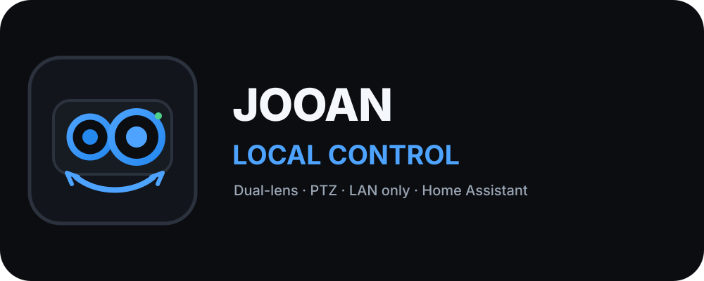

<p align="center">
  
</p>

<h1 align="center">JOOAN Local Control</h1>

<p align="center">
  Controle local de câmeras JOOAN/CAM720 compatíveis diretamente pela LAN no Home Assistant.
</p>

<p align="center">
  
  
  
  
</p>

## Instalação

[](https://my.home-assistant.io/redirect/supervisor_add_addon_repository/?repository_url=https%3A%2F%2Fgithub.com%2Flucaslucian%2Fha-jooan-ptz)

Se o botão não preencher o repositório automaticamente:

1. Abra **Configurações → Apps → Loja de Apps**.
2. Abra **⋮ → Repositórios**.
3. Adicione `https://github.com/lucaslucian/ha-jooan-ptz`.
4. Instale **JOOAN Local Control**.
5. Configure IP, usuário e senha local da câmera.
6. Inicie o App e abra o painel pelo Home Assistant.

## Recursos

| Recurso | Implementação |
|---|---|
| Validação e autenticação local | CGI |
| PTZ cima/baixo/esquerda/direita/stop | CGI |
| PTZ com velocidade | ONVIF `ContinuousMove`, com fallback CGI |
| Duas lentes | identificação automática quando reportadas pela câmera |
| Identificação da lente PTZ | mapeamento do perfil ONVIF |
| Imagens | snapshots RTSP sob demanda |
| Acompanhamento durante PTZ | snapshots da lente PTZ em até 1 FPS |
| Estado do dispositivo | modelo, firmware, rede, canais e serviços |
| Estado OEM | porta 9898 em modo somente leitura |
| SD, gravação, detecção, tracking e iluminação | somente leitura |
| Heartbeat | ICMP, sem abrir sessões de mídia |

## Painel

A área principal mantém **Lente 1, Lente 2 e o controle PTZ na mesma linha** em telas maiores.

- apenas a lente realmente associada ao PTZ recebe a marcação **PTZ**;
- snapshots das duas lentes são independentes;
- durante o movimento, somente a lente PTZ é atualizada automaticamente;
- após `STOP`, são feitas capturas adicionais para mostrar a posição final já estabilizada;
- **Informações gerais** ficam recolhidas por padrão logo abaixo da área operacional;
- os demais estados ficam organizados em seções expansíveis de leitura.

## Funcionamento

### Inicialização

O App executa somente operações locais necessárias:

1. valida as credenciais pelo CGI;
2. lê identificação e estado de rede;
3. lê capabilities e estado OEM na porta 9898;
4. obtém a configuração RTSP sem abrir o stream.

O ONVIF é descoberto apenas quando o PTZ é usado pela primeira vez. Os streams RTSP são abertos somente para capturar snapshots.

### PTZ

O CGI local é o caminho de fallback permanente.

Quando a câmera oferece um perfil PTZ ONVIF utilizável, o App usa `ContinuousMove` para permitir velocidade variável. Se a operação ONVIF falhar ou for rejeitada, o controle continua automaticamente pelo CGI.

### Snapshots

Os streams principais conhecidos são:

```text
/live/ch00_0
/live/ch01_0
```

A URL autenticada é montada exclusivamente no backend. Usuário, senha e URL RTSP completa não são devolvidos ao navegador.

### Por que não mantemos um stream de vídeo contínuo

A JA-A12 usada como referência mostrou uma limitação importante: o firmware embarcado possui poucos recursos para manter várias conexões locais simultâneas. Quando outro software, NVR ou integração já está consumindo o RTSP continuamente, novas conexões RTSP/HTTP/ONVIF podem deixar os serviços da câmera lentos, travados ou temporariamente inacessíveis, mesmo enquanto ela continua respondendo na rede.

Por isso o App **não mantém uma sessão RTSP aberta**. Para mostrar imagem, ele abre o stream apenas pelo tempo necessário para capturar um único frame JPEG e fecha a conexão em seguida. Durante o movimento PTZ, essa mesma estratégia é repetida com baixa frequência e somente na lente PTZ.

Esse comportamento reduz a disputa com NVRs e outros consumidores do vídeo e foi a forma mais estável encontrada para usar a câmera localmente sem provocar perda de acesso aos serviços dela.

## Segurança

- o destino da câmera precisa ser um IP local permitido;
- não existe proxy genérico de URL ou de comandos CGI;
- comandos PTZ e paths RTSP são allowlisted;
- credenciais permanecem no backend;
- respostas e logs passam por mascaramento de segredos;
- o App não altera firmware, rede, Wi-Fi ou configurações internas da câmera.

## Portas utilizadas

| Porta | Protocolo | Uso |
|---|---|---|
| 80/TCP | HTTP | autenticação, identificação e PTZ CGI |
| 554/TCP | RTSP | snapshots |
| 9898/TCP | HTTP | capabilities e estado OEM |
| 8899/TCP | ONVIF | descoberta mínima e PTZ |

As portas podem ser ajustadas nas opções do App.

## Compatibilidade

A unidade principal de referência é uma **JOOAN JA-A12 / CAM720 dual-lens** com firmware original. Outras revisões podem reutilizar o mesmo nome comercial com diferenças de hardware ou firmware.

Consulte [Compatibilidade](docs/COMPATIBILITY.md) para o estado validado.

## Documentação

- [Documentação do App](jooan_ptz/DOCS.md)
- [Protocolo local utilizado](docs/LOCAL_PROTOCOL.md)
- [Compatibilidade](docs/COMPATIBILITY.md)
- [Changelog](jooan_ptz/CHANGELOG.md)

<sub>Nota: o desenvolvimento deste projeto, incluindo partes do código e da documentação, contou com apoio de ferramentas de inteligência artificial.</sub>
